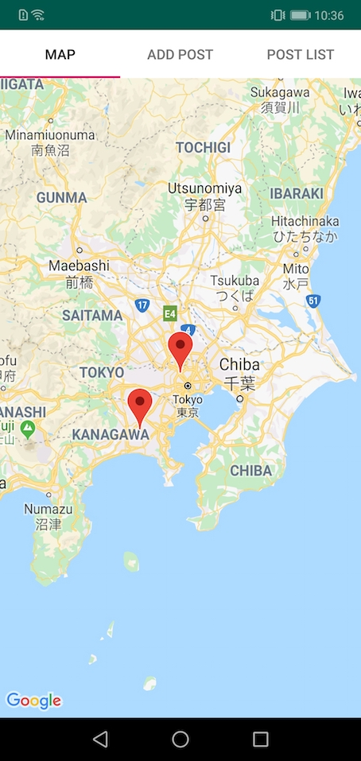
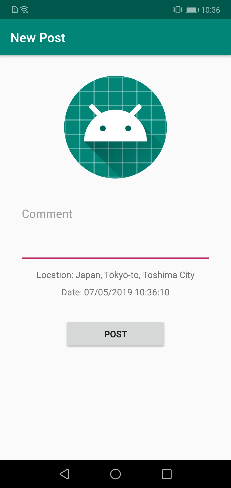
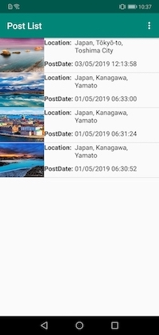
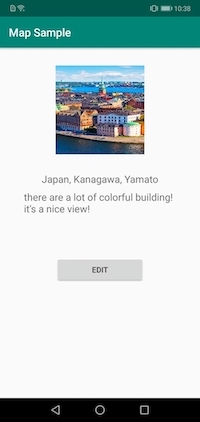

# マップアプリ
訪れた場所の位置情報と紐付けて写真やコメントを保存できるアプリ

## 特徴
* 写真付きの投稿追加
* 投稿時の写真ライブラリ・カメラとの連携
* 投稿一覧の閲覧、投稿の編集・削除
* 地図上での投稿に紐づいた場所の閲覧

## 開発環境
* Java 8
* Android SDK（API 28: Android 9.0 (Pie)）
* Android Studio 3.2.1
* Gradle 4.6
* SQLite

### ダウンロード後の注意点
google_maps_api.xmlのgoogle_maps_keyを変更する必要があります。

## ライセンス
当ライセンスは GNU General Public License v3.0の規約に基づいて付与されています。 - 詳細はこちらを参照。 [LICENSE.txt](LICENSE.txt)
